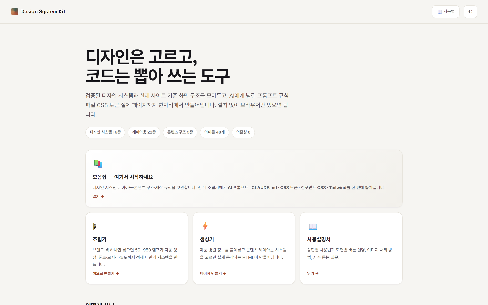
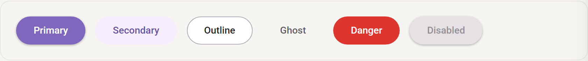
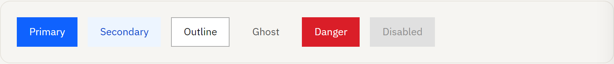
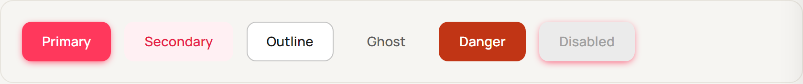
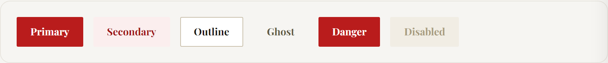
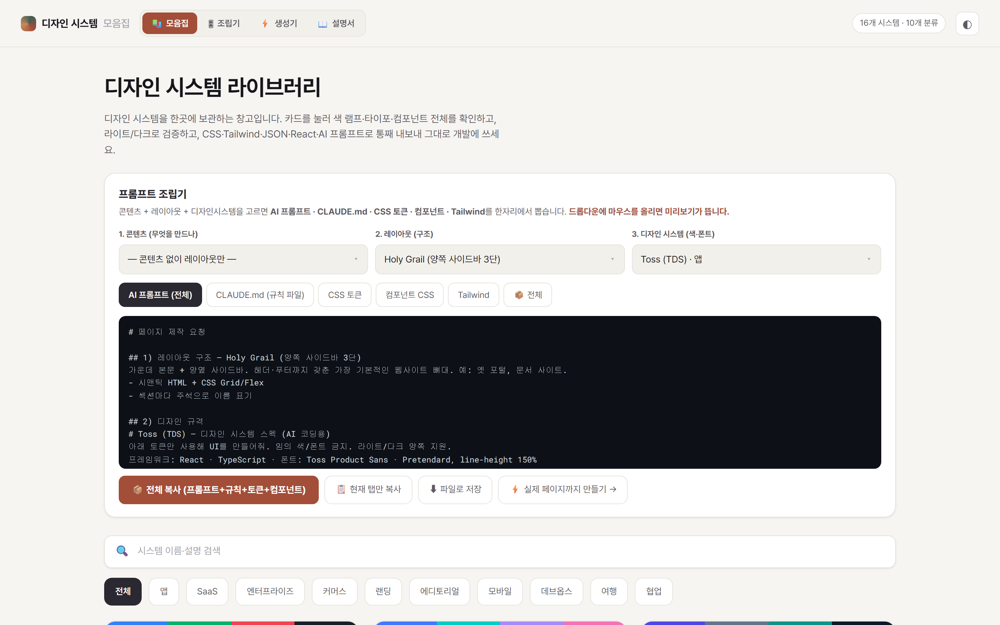
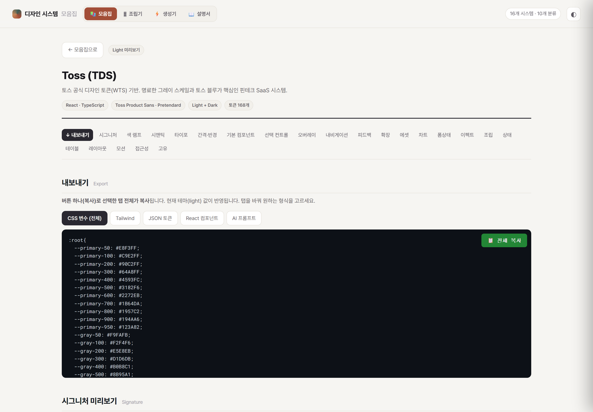
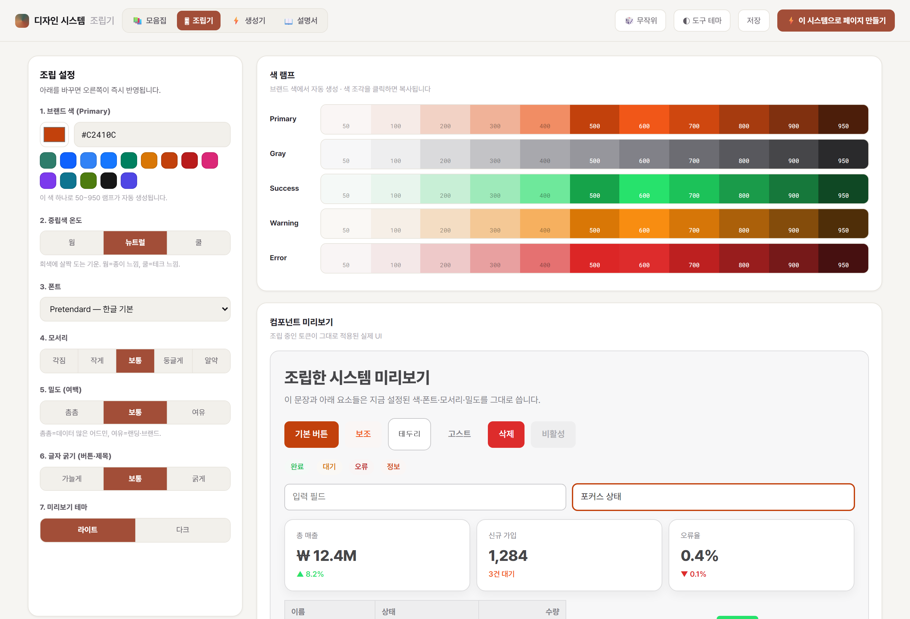
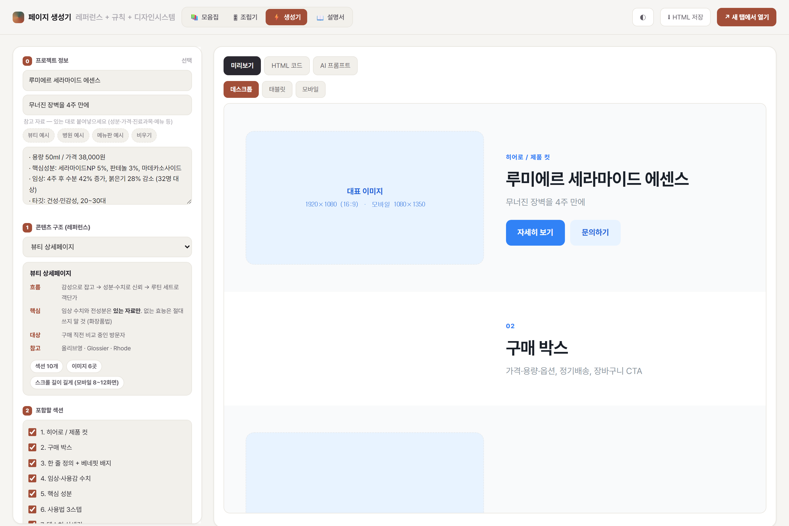

# Design System Kit

디자인 시스템과 화면 구조를 모아두고, **AI에게 넘길 프롬프트 · 규칙 파일 · CSS 토큰 · 실제 페이지**까지 만들어내는 도구입니다.
빌드 도구나 설치 없이, 브라우저에서 HTML 파일을 열면 바로 동작합니다.

**🔗 [바로 열어보기](https://yehsb123.github.io/design-system-kit/)**



## 담겨 있는 것

| | 수량 | 내용 |
|---|---|---|
| 디자인 시스템 | 16종 | Toss · Ant Design · Material 3 · IBM Carbon · Apple HIG · Shopify Polaris · Vercel · GitLab · Airbnb · Slack 등 |
| 레이아웃 패턴 | 22종 | Holy Grail · 대시보드 · 지그재그 · 벤토 · 메뉴판 4종 등 |
| 콘텐츠 구조 | 9종 | 뷰티 상세 · SaaS 랜딩 · 메뉴판 · 병원 · 포트폴리오 · 앱 소개 등 |
| 아이콘 | 48개 | SVG 스프라이트 · 개별 파일 · React 컴포넌트 · CSS로 내보내기 |

### 색만 바뀌는 게 아닙니다

시스템마다 **폰트 · 모서리 · 그림자 · 아이콘 굵기 · 컴포넌트 모양**이 실제로 다릅니다.

| | |
|---|---|
| **Material 3** — 알약형 버튼, Roboto | **IBM Carbon** — 직각, IBM Plex Sans |
|  |  |
| **Airbnb** — 코랄, 둥근 모서리, Manrope | **Editorial** — 세리프(Playfair), 각진 형태 |
|  |  |

## 화면 4개

| 파일 | 역할 |
|---|---|
| `library.html` | **모음집** — 시스템·레이아웃·구조·규칙을 보관. 맨 위 조립기에서 프롬프트·CLAUDE.md·CSS·컴포넌트를 뽑습니다 |
| `builder.html` | **조립기** — 브랜드 색 하나로 50~950 램프를 자동 생성해 나만의 시스템을 만듭니다 |
| `generator.html` | **생성기** — 제품·병원 정보를 넣고 실제 동작하는 HTML 페이지를 만듭니다 |
| `guide.html` | **사용설명서** — 상황별 사용법과 자주 묻는 질문 |

### 모음집 — 여기서 대부분 끝납니다

콘텐츠 · 레이아웃 · 디자인 시스템을 고르면 **AI 프롬프트 / CLAUDE.md / CSS 토큰 / 컴포넌트 CSS / Tailwind**가 한자리에서 나옵니다.
드롭다운 항목에 마우스를 올리면 그 항목의 미리보기가 옆에 뜹니다.



시스템 상세에는 색 램프(50~950), 시맨틱 토큰, 컴포넌트, 에셋, 차트, 접근성까지 들어 있고 라이트/다크를 오갈 수 있습니다.



### 조립기 — 색 하나로 시스템 만들기

브랜드 색을 넣으면 11단계 램프가 자동 계산되고, 폰트·모서리·밀도를 바꾸면 오른쪽 미리보기가 즉시 반영됩니다.
내보내기에는 **대비(WCAG AA) 검사 결과**가 함께 들어갑니다.



### 생성기 — 실제 페이지까지

제품명·소개·참고 자료를 붙여넣고 콘텐츠·레이아웃·시스템을 고르면 동작하는 HTML이 만들어집니다.
데스크톱·태블릿·모바일로 바로 확인하고 파일로 저장할 수 있습니다.



## 쓰는 법

### 1. AI에게 화면을 시킬 때 (약 30초)
`library.html` → 맨 위 조립기에서 **콘텐츠 · 레이아웃 · 디자인 시스템**을 고르고 `AI 프롬프트` 탭 복사 → AI에 붙여넣기.

섹션 순서(실제 사이트 조사분) + 색·폰트 토큰 + 반응형·이미지·접근성 규칙이 한 덩어리로 들어가, AI가 임의로 만들지 않습니다.

### 2. 프로젝트에 규칙을 심어둘 때
`CLAUDE.md` 탭 → **파일로 저장** → 프로젝트 최상단에 배치.
이후 그 폴더에서 작업하면 매번 복사하지 않아도 규칙이 적용됩니다. `design-tokens.css` · `components.css`도 같이 받아 넣으면 됩니다.

### 3. 고객이 브랜드 색을 줬을 때
`builder.html`에 HEX 입력 → 램프 자동 생성 → **이 시스템으로 페이지 만들기** → 생성기에서 콘텐츠만 고르면 완성.

## 특징

- **이미지 규격이 화면에 표시됩니다** — 히어로 1920×1080(16:9), 인물 800×800(1:1)처럼 섹션마다 권장 크기가 붙습니다. 이미지는 다른 도구로 만들고 규격만 맞추면 됩니다.
- **반응형이 기본** — `clamp()`, `min(1200px, 92vw)`, 768px 미만 1열이 생성물과 프롬프트 양쪽에 들어갑니다.
- **접근성** — 대비(WCAG AA) 자동 계산, `focus-visible` 링, `prefers-reduced-motion` 대응.
- **프롬프트와 코드가 일치** — 프롬프트에 실제 생성된 CSS가 그대로 포함되어, AI가 같은 결과를 냅니다.
- **내 규칙 추가** — 직접 넣은 규칙이 모든 출력에 자동 포함되고 브라우저에 저장됩니다.

## 실행

```bash
git clone https://github.com/yehsb123/design-system-kit.git
cd design-system-kit
# index.html 을 브라우저로 열기
```

로컬 파일을 그대로 열어도 되고, 정적 호스팅에 올려도 됩니다. 인터넷은 웹폰트(Pretendard, Google Fonts) 로딩에만 사용합니다.

## 구조

```
index.html        시작 화면
library.html      모음집
builder.html      조립기
generator.html    생성기
guide.html        사용설명서
pages.json        콘텐츠 구조 원본 데이터
docs/screenshots  README용 이미지
```

새 디자인 시스템을 추가하려면 `library.html`의 `SYSTEMS` 배열에 항목을 하나 추가하면 됩니다. 색 램프(50~950)와 이름·분류만 있으면 카드·상세·내보내기가 자동으로 생성됩니다.

## 라이선스

MIT
