# Design System Kit

디자인 규격을 뽑아 AI에게 넘기는 도구입니다.
검증된 디자인 시스템과 실제 사이트 기준 화면 구조를 모아 두고, 프롬프트와 규칙 파일과 CSS 토큰과 실제 페이지를 꺼내 씁니다.
파일 하나를 브라우저로 열면 됩니다. 설치도 빌드도 없습니다.

[바로 열어보기](https://yehsb123.github.io/design-system-kit/)

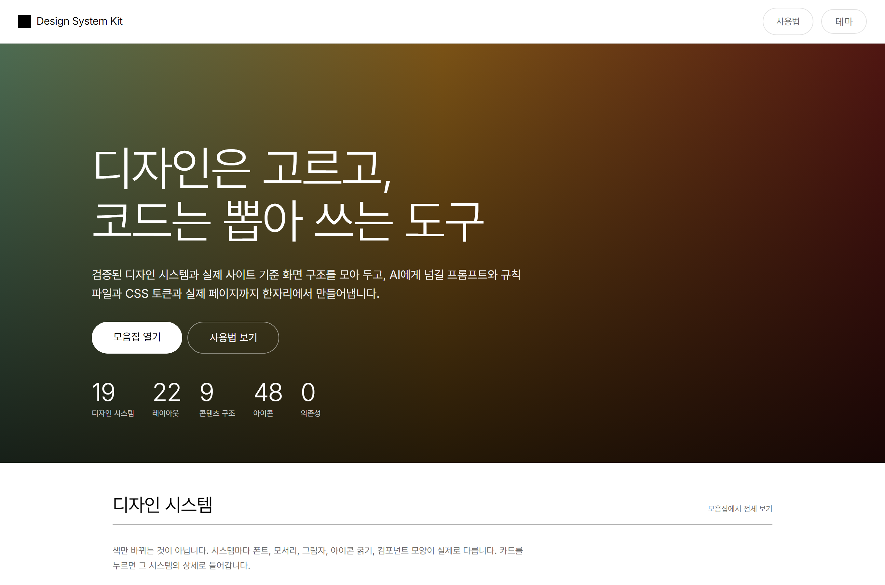

시작 화면이 킷의 재료를 그대로 보여 줍니다. 시스템 19종의 색 띠, 레이아웃 와이어프레임, 아이콘을 누르면 그 항목으로 바로 들어갑니다.
데이터는 모음집 한 곳에만 두고, 묶을 때 꺼내 심습니다.

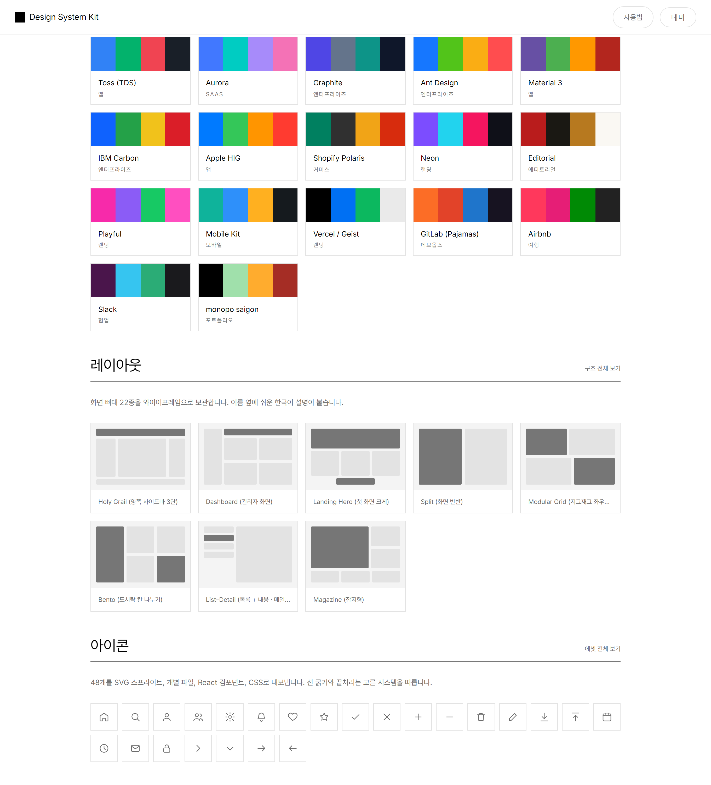

## 담겨 있는 구성

| | 수량 | 내용 |
|---|---|---|
| 디자인 시스템 | 19종 | Toss, Ant Design, Material 3, IBM Carbon, Apple HIG, Shopify Polaris, Vercel, GitLab, Airbnb, Slack, monopo saigon, Bevel, Wise 등 |
| 레이아웃 패턴 | 22종 | Holy Grail, 대시보드, 지그재그, 벤토, 메뉴판 4종 등 |
| 콘텐츠 구조 | 9종 | 뷰티 상세, SaaS 랜딩, 메뉴판, 병원, 포트폴리오, 앱 소개 등 |
| 아이콘 | 48개 | SVG 스프라이트, 개별 파일, React 컴포넌트, CSS로 내보내기 |

### 색만 바뀌는 게 아닙니다

시스템마다 폰트, 모서리, 그림자, 아이콘 굵기, 컴포넌트 모양이 실제로 다릅니다.
그 성격이 가장 잘 드러나는 대표 UI를 시스템마다 따로 그립니다.

| | |
|---|---|
| **monopo saigon** 무채색, 알약 버튼에 직각 카드 | **IBM Carbon** 직각, IBM Plex Sans, 고밀도 표 |
| 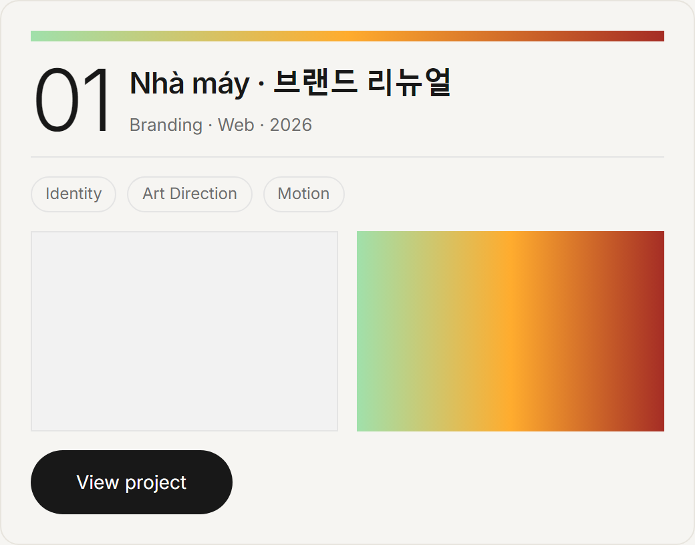 | 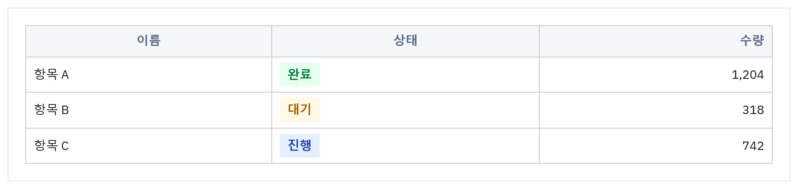 |
| **Airbnb** 코랄, 큰 라운드, 사진 카드 | **Material 3** 알약 버튼, Roboto, 엘리베이션 |
| 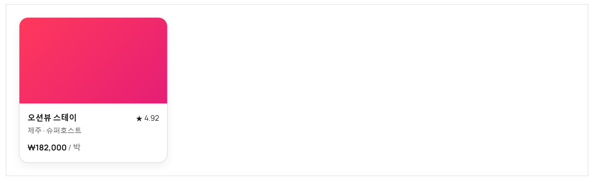 | 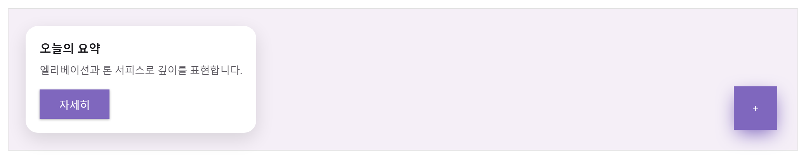 |
| **Bevel** 구름빛 카드, 하늘 그라디언트, 128px 알약 | **Wise** 숲색과 라임, 구역 교차, 평평한 면 |
| 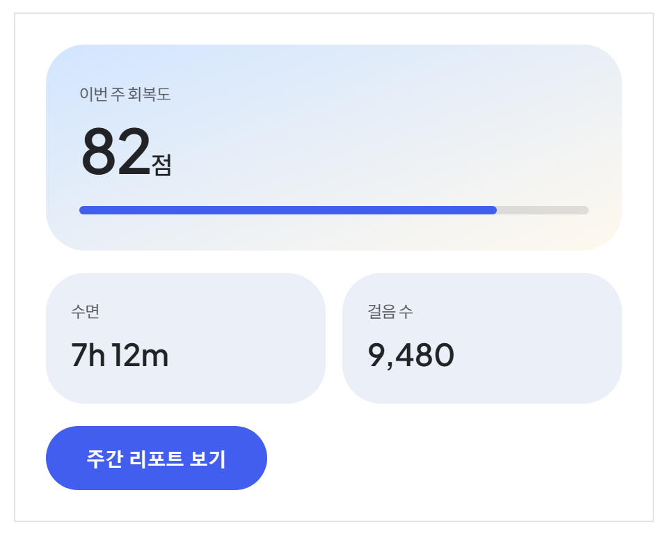 | 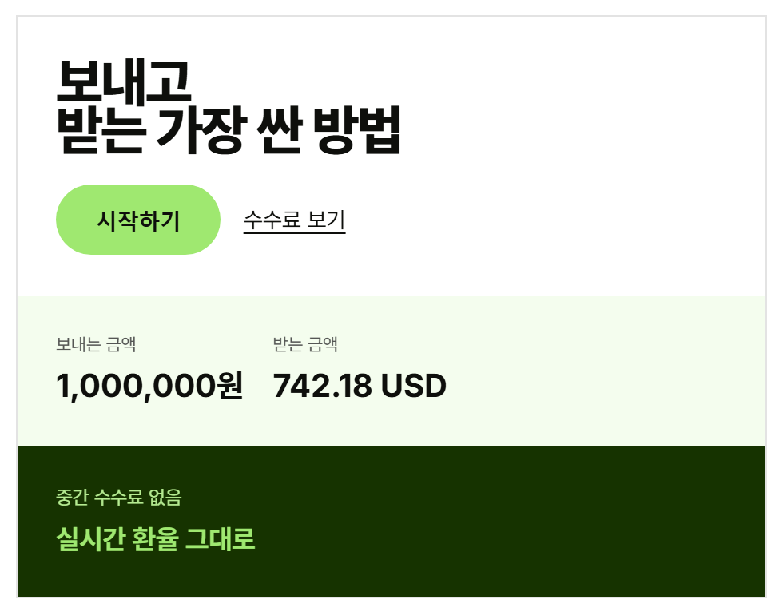 |

## 화면 다섯 개, 파일 하나

`index.html` 하나에 화면 다섯 개가 들어 있습니다. 상단 내비로 오갑니다.

| 화면 | 역할 |
|---|---|
| 모음집 | 시스템, 레이아웃, 콘텐츠 구조, 제작 규칙을 보관합니다. 맨 위 조립기에서 프롬프트, CLAUDE.md, CSS, 컴포넌트를 뽑습니다 |
| 조립기 | 브랜드 색 하나로 50~950 램프를 자동 생성해 나만의 시스템을 만듭니다 |
| 생성기 | 제품이나 병원 정보를 넣고 실제 동작하는 HTML 페이지를 만듭니다 |
| 사용설명서 | 상황별 사용법과 자주 묻는 질문 |

주소가 자리를 기억합니다. `#library?sys=monopo` 처럼 바뀌므로 뒤로가기와 Esc로 목록에 돌아오고, 주소를 보내면 상대도 같은 화면을 봅니다.

### 모음집에서 대부분 끝납니다

콘텐츠, 레이아웃, 디자인 시스템을 고르면 AI 프롬프트, CLAUDE.md, CSS 토큰, 컴포넌트 CSS, Tailwind가 한자리에서 나옵니다.
드롭다운 항목에 마우스를 올리면 그 항목의 미리보기가 옆에 뜹니다.

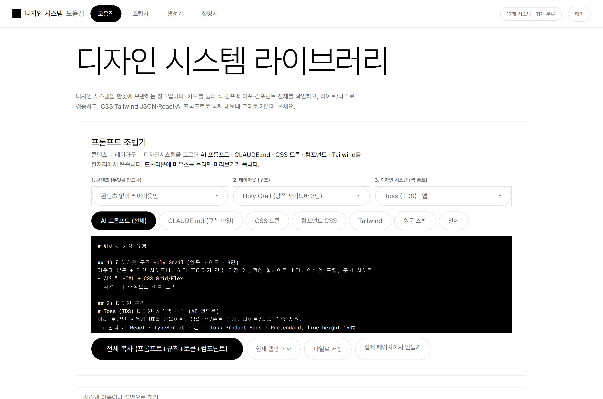

시스템 상세에는 색 램프(50~950), 시맨틱 토큰, 컴포넌트, 에셋, 차트, 접근성이 들어 있습니다. 라이트와 다크를 오갈 수 있습니다.

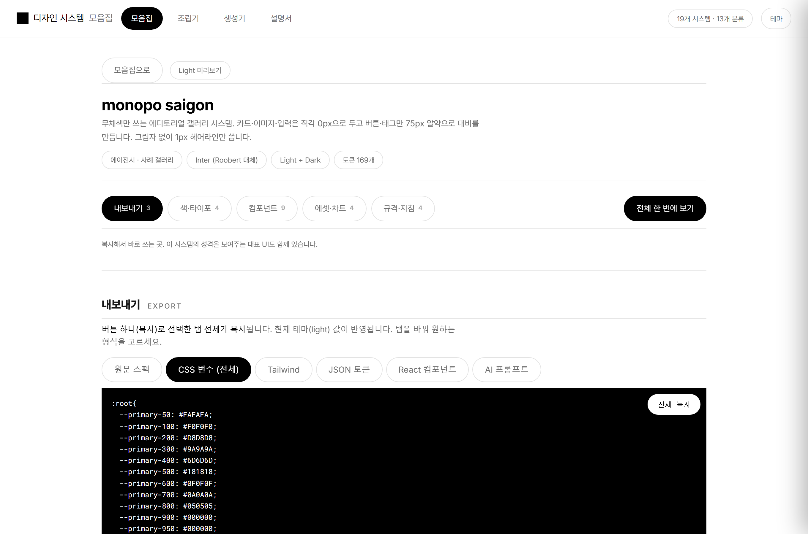

### 시스템마다 스펙 문서가 있습니다

19종 모두 스펙 문서를 가집니다. 색 램프 66단계, 역할별 색의 라이트와 다크, 폰트 스택, 모서리와 굵기와 그림자, 아이콘 선 굵기, 컴포넌트 규칙, 대비 계산, 지킬 규칙과 금지 사항, CSS 변수와 Tailwind 설정이 들어갑니다.

출처를 구분해 적습니다. 실제 사이트를 재서 뽑은 추출본인지, 킷이 들고 있는 토큰으로 만든 문서인지, 직접 붙여넣은 스펙인지 화면에서 바로 보입니다. 재지 않은 값은 적지 않습니다.

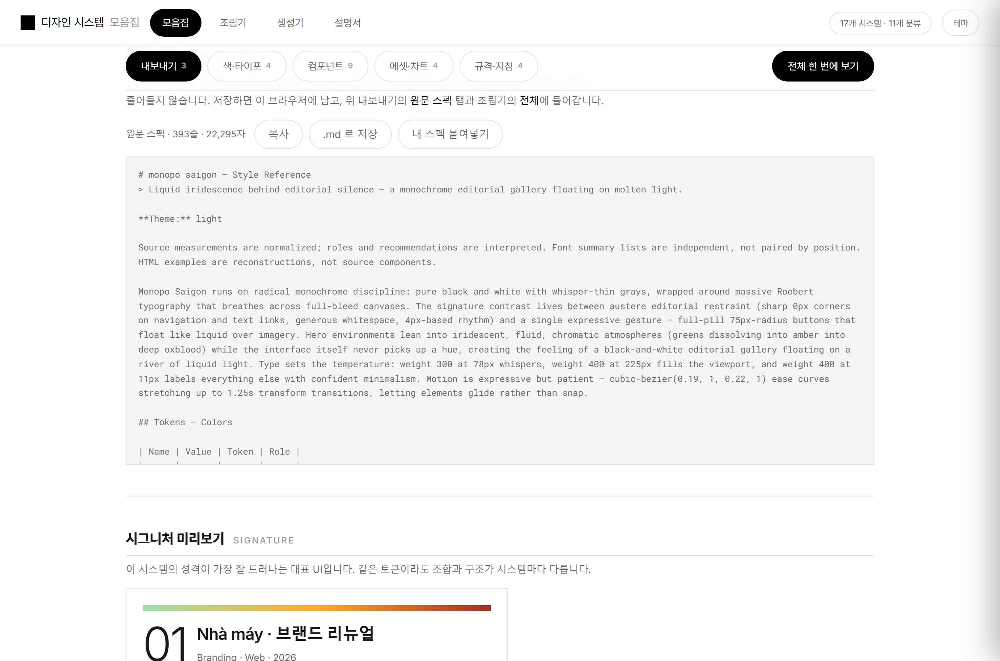

### 조립기에서 색 하나로 시스템 만들기

브랜드 색을 넣으면 11단계 램프가 자동으로 계산되고, 폰트와 모서리와 밀도를 바꾸면 오른쪽 미리보기가 바로 바뀝니다.
내보내기에는 대비(WCAG AA) 검사 결과가 함께 들어갑니다.

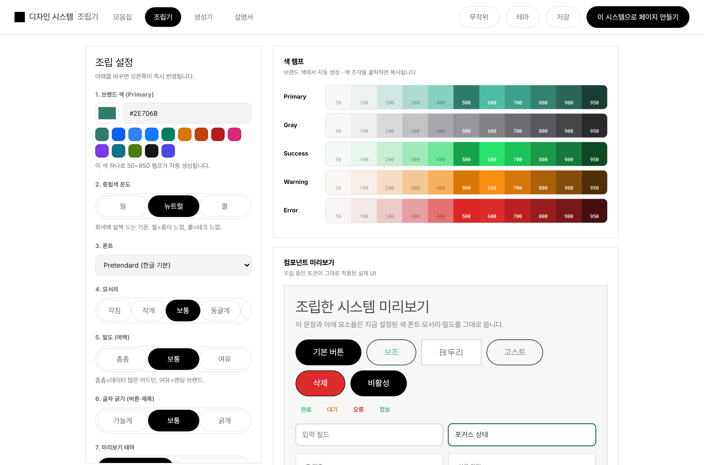

### 생성기로 실제 페이지까지

제품명과 소개와 참고 자료를 붙여넣고 콘텐츠와 레이아웃과 시스템을 고르면 동작하는 HTML이 나옵니다.
데스크톱, 태블릿, 모바일로 바로 확인하고 파일로 저장할 수 있습니다.

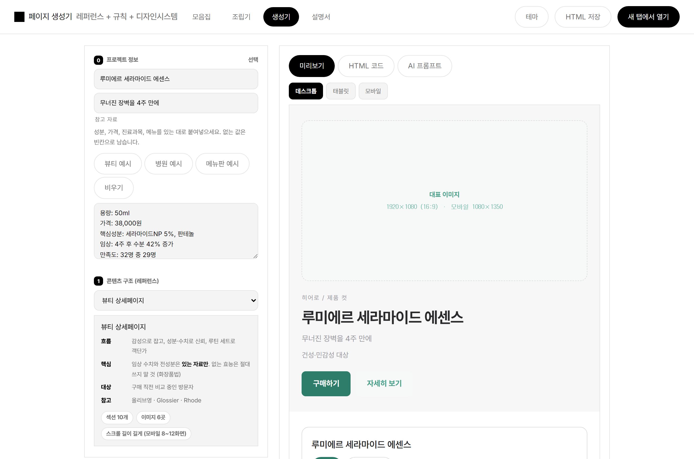

섹션마다 쓰임에 맞는 구조가 들어갑니다. 히어로, 구매 박스, 베네핏 배지, 수치, 성분 카드, 사용 단계, 상세컷, 세트, 리뷰, 고지 아코디언처럼 서른 가지입니다.
붙여넣은 자료에서 가격, 용량, 성분, 수치를 읽어 해당 자리에 넣고, 없는 값은 지어내지 않고 넣을 자리로 표시합니다.

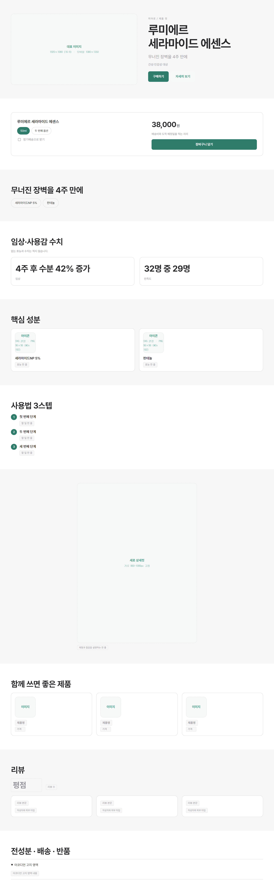

여섯 종 모두 390px 에서 가로로 넘치지 않습니다.

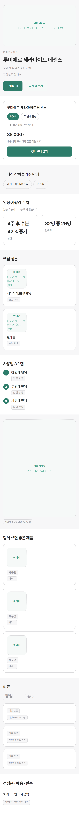

## 쓰는 법

### 1. AI에게 화면을 시킬 때 (약 30초)

모음집 맨 위 조립기에서 콘텐츠, 레이아웃, 디자인 시스템을 고르고 `AI 프롬프트` 탭을 복사해 AI에 붙여넣습니다.

섹션 순서(실제 사이트 조사분), 색과 폰트 토큰, 반응형과 이미지와 접근성 규칙이 한 덩어리로 들어가므로 AI가 임의로 만들지 않습니다.
복사하면 몇 자를 복사했는지와 다음에 무엇을 하면 되는지가 버튼 아래에 남습니다.

### 2. 프로젝트에 규칙을 심어둘 때

`CLAUDE.md` 탭에서 파일로 저장해 프로젝트 최상단에 둡니다.
이후 그 폴더에서 작업하면 매번 복사하지 않아도 규칙이 적용됩니다. `design-tokens.css` 와 `components.css` 도 같이 받아 넣으면 됩니다.

### 화면별 버튼과 자주 묻는 질문

설명서에 상황별 순서와 화면마다 어떤 버튼이 무엇을 하는지 적어 두었습니다.

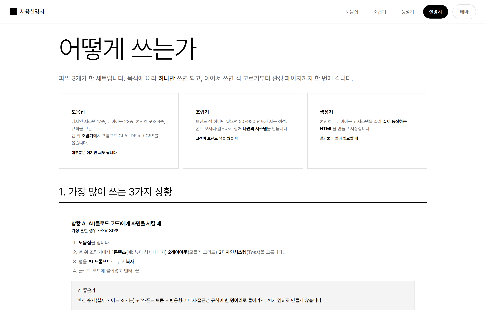

### 3. 고객이 브랜드 색을 줬을 때

조립기에 HEX를 넣어 램프를 만들고 `이 시스템으로 페이지 만들기` 를 누릅니다. 생성기에서 콘텐츠만 고르면 완성됩니다.

## 특징

- **이미지 규격이 화면에 표시됩니다.** 히어로 1920×1080(16:9), 인물 800×800(1:1)처럼 섹션마다 권장 크기가 붙습니다. 이미지는 다른 도구로 만들고 규격만 맞추면 됩니다.
- **반응형이 기본입니다.** `clamp()`, `min(1200px, 92vw)`, 768px 미만 1열이 생성물과 프롬프트 양쪽에 들어갑니다.
- **한글이 단어 단위로 끊깁니다.** `word-break: keep-all` 과 `line-break: strict` 가 킷과 생성물 양쪽에 들어갑니다.
- **접근성.** 대비(WCAG AA) 자동 계산, `focus-visible` 링, `prefers-reduced-motion` 대응. 카드는 탭으로 닿고 Enter로 열립니다.
- **프롬프트와 코드가 일치합니다.** 프롬프트에 실제 생성된 CSS가 그대로 들어가므로 AI가 같은 결과를 냅니다.
- **내 규칙 추가.** 직접 넣은 규칙이 모든 출력에 자동으로 들어가고 브라우저에 저장됩니다.

## 실행

```bash
git clone https://github.com/yehsb123/design-system-kit.git
cd design-system-kit
# index.html 을 브라우저로 열기
```

로컬 파일을 그대로 열어도 되고, 정적 호스팅에 올려도 됩니다. 인터넷은 웹폰트(Inter, Pretendard) 로딩에만 씁니다.

## 구조

```
index.html           화면 다섯 개를 담은 한 파일. 이것만 열면 됩니다
build.py             src 를 index.html 로 묶습니다
restyle.py           화면마다 kit.css 를 연결합니다
shots.py             README 에 쓰는 그림을 다시 찍습니다
dedupe_css.py        화면 CSS 에서 kit.css 와 겹치는 선언을 지웁니다
src/kit.css          화면이 함께 쓰는 셸 스타일시트
src/index.html       시작 화면 (묶이기 전 원본)
src/library.html     모음집
src/builder.html     조립기
src/generator.html   생성기
src/guide.html       사용설명서
pages.json           콘텐츠 구조 원본 데이터
docs/screenshots     README용 이미지
test_ui.py           조작부를 하나씩 눌러 반응을 봅니다
test_flow.py         쓰는 순서대로 밟습니다
test_a11y.py         다크 모드, 모바일 폭, 키보드, 대비를 봅니다
```

셸 스타일은 `src/kit.css` 한 곳에만 있습니다. 화면마다 따로 정의하지 않습니다.
각 화면의 `<style>` 뒤에 실려서 같은 선택자면 kit.css 가 적용됩니다.

새 디자인 시스템을 추가하려면 `src/library.html` 의 `SYSTEMS` 배열에 항목을 하나 더하면 됩니다.
색 램프(50~950)와 이름과 분류만 있으면 카드, 상세, 스펙 문서, 내보내기가 모두 자동으로 생깁니다.

## 검사

```bash
python test_ui.py     # 조작부 하나씩
python test_flow.py   # 쓰는 순서대로
python test_a11y.py   # 다크 모드, 390px, 키보드, 대비
```

세 벌 모두 `index.html` 을 헤드리스 크롬으로 열어 돌립니다. 고치고 나면 `python build.py` 로 다시 묶은 뒤 검사합니다.

`test_ui.py` 는 조작부를 눌러 화면 변화, 알림, 복사, 저장, 테마 중 무엇이라도 일어나는지 봅니다.
`test_a11y.py` 는 다섯 화면을 라이트와 다크로 각각 열어 모든 글자의 대비를 재고, 390px 에서 가로로 넘치는 요소를 찾고, 키보드로 시스템을 여는지 봅니다.

## 라이선스

GNU Affero General Public License v3.0 (AGPL-3.0)

Copyright (C) 2026 yehsb123

가져다 쓰고 고치는 것은 자유입니다. 다만 고친 것을 배포하거나 서버에 올려 서비스로 제공하면, 그 소스도 같은 라이선스로 공개해야 합니다. 전문은 [LICENSE](LICENSE) 에 있습니다.
